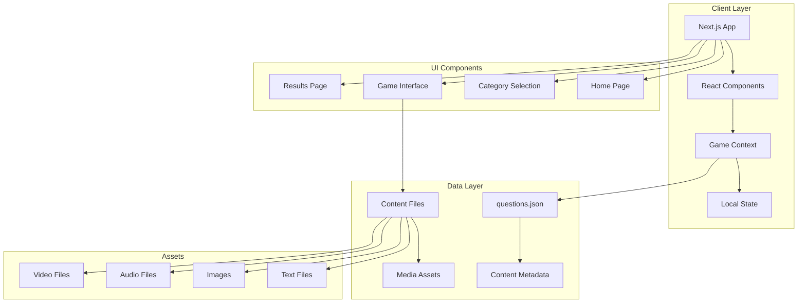
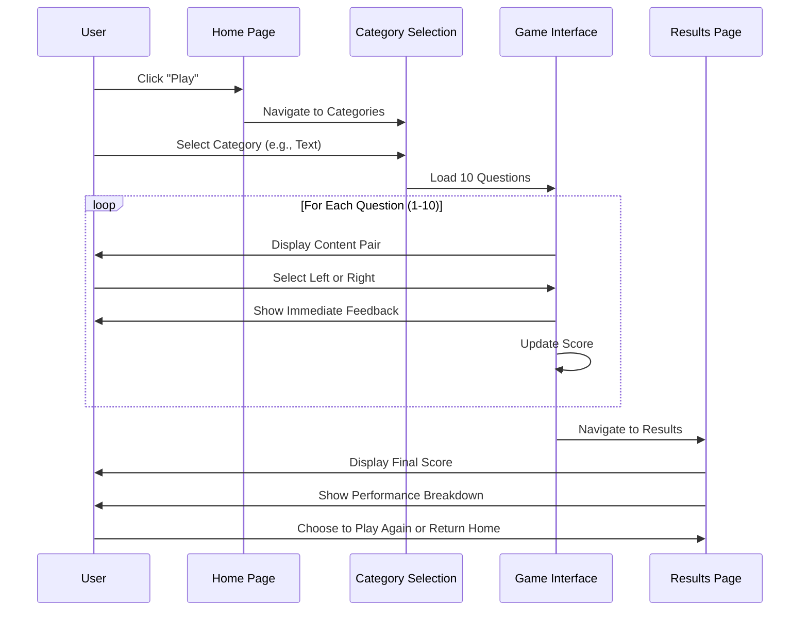
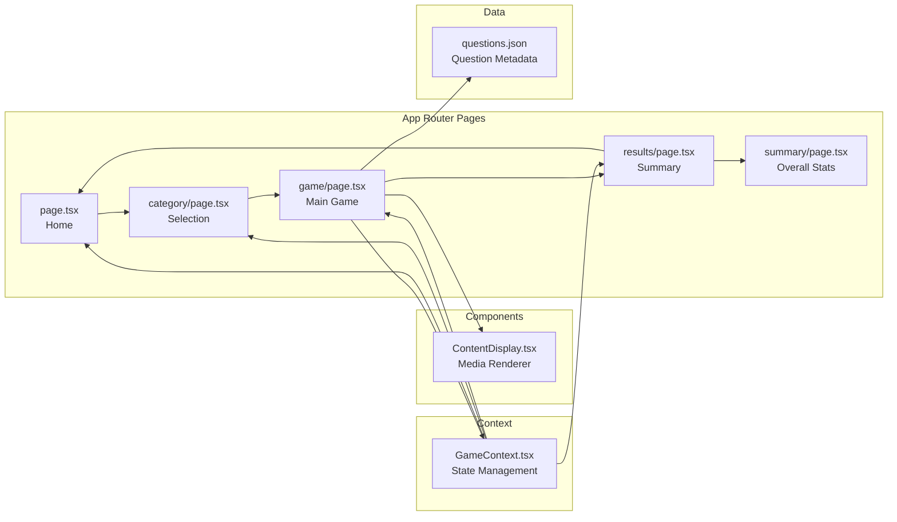
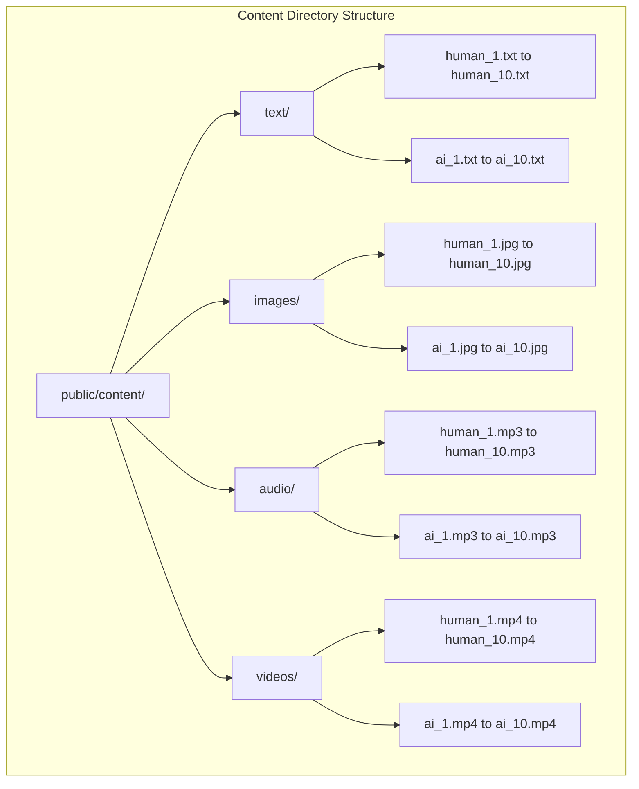
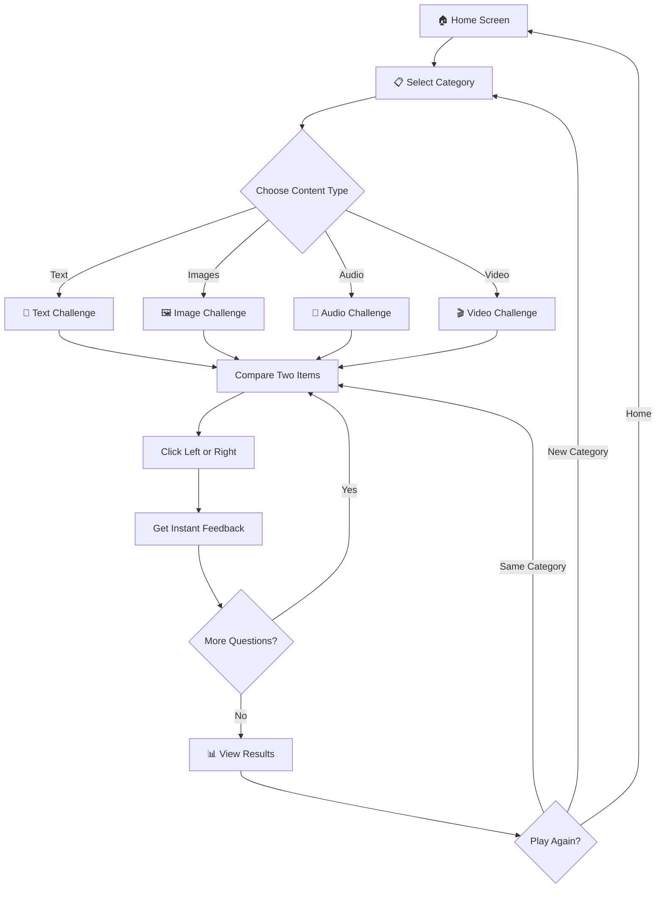

<div align="center"><a name="readme-top"></a>

# 🤖 AI vs Human Guessing Game 👤<br/><h3>Test Your Ability to Distinguish AI from Human Content</h3>

An interactive web-based quiz game that challenges players to identify whether content is AI-generated or human-created across four engaging categories: Text, Images, Audio, and Video.<br/>
Features beautiful pond-themed UI, real-time scoring, and progressive difficulty.<br/>
One-click **FREE** deployment ready.

[](https://ai-human-game.vercel.app/)

<br/>

<!-- SHIELD GROUP -->

[![][next-shield]][next-link]
[![][typescript-shield]][typescript-link]
[![][tailwind-shield]][tailwind-link]
[![][license-shield]][license-link]

**Share This Game**

[![][share-x-shield]][share-x-link]
[![][share-linkedin-shield]][share-linkedin-link]
[![][share-reddit-shield]][share-reddit-link]

<sup>🎯 Challenge your perception. Can you tell the difference between AI and human creativity?</sup>

</div>

> [!IMPORTANT]
> This interactive game helps users understand the capabilities and limitations of AI-generated content. Perfect for educators, AI enthusiasts, and anyone curious about the future of content creation. Features include 4 content categories, 10 questions per category, and comprehensive performance analytics.

<details>
<summary><kbd>📑 Table of Contents</kbd></summary>

#### TOC

- [🤖 AI vs Human Guessing Game 👤Test Your Ability to Distinguish AI from Human Content](#-ai-vs-human-guessing-game-test-your-ability-to-distinguish-ai-from-human-content)
      - [TOC](#toc)
      - [](#)
  - [🌟 Introduction](#-introduction)
  - [🎮 Live Demo](#-live-demo)
  - [✨ Key Features](#-key-features)
    - [`1` Multi-Category Content Testing](#1-multi-category-content-testing)
    - [`2` Interactive Gameplay](#2-interactive-gameplay)
    - [`*` Additional Features](#-additional-features)
  - [🎮 Game Screenshots](#-game-screenshots)
    - [Home Screen](#home-screen)
  - [🛠️ Tech Stack](#️-tech-stack)
  - [🏗️ Architecture](#️-architecture)
    - [System Architecture](#system-architecture)
    - [Game Flow](#game-flow)
    - [Component Structure](#component-structure)
  - [🚀 Getting Started](#-getting-started)
    - [Prerequisites](#prerequisites)
    - [Quick Installation](#quick-installation)
    - [Content Setup](#content-setup)
  - [📁 Project Structure](#-project-structure)
  - [🎯 How to Play](#-how-to-play)
  - [🏆 Scoring System](#-scoring-system)
  - [🎨 Customization](#-customization)
    - [Modify Question Descriptions](#modify-question-descriptions)
    - [Randomize Human Position](#randomize-human-position)
    - [Customize Styling](#customize-styling)
  - [🛳 Deployment](#-deployment)
    - [Cloud Deployment Options](#cloud-deployment-options)
    - [Build Commands](#build-commands)
  - [🐛 Troubleshooting](#-troubleshooting)
  - [📄 License](#-license)
  - [🙋‍♀️ Author](#️-author)

####

<br/>

</details>

## 🌟 Introduction

Welcome to the AI vs Human Guessing Game! This project explores the fascinating boundary between AI-generated and human-created content. As AI technology rapidly advances, distinguishing between artificial and authentic content becomes increasingly challenging. This game provides an engaging platform to test and improve your detection skills across multiple content types.

Whether you're a student learning about AI, an educator teaching digital literacy, or simply curious about AI capabilities, this game offers valuable insights into the current state of generative AI technology.

## 🎮 Live Demo

Experience the game now at **[https://ai-human-game.vercel.app/](https://ai-human-game.vercel.app/)**

> [!NOTE]
> - Node.js >= 18.0 required for local development
> - No external API keys needed
> - Content files must be provided by users for custom deployment
> - Works fully offline after setup

> [!TIP]
> **⭐ Star this repository** to stay updated with new features and content categories!

<details>
<summary><kbd>⭐ Star History</kbd></summary>

> Add star history chart after repository gains traction

</details>

## ✨ Key Features

### `1` Multi-Category Content Testing

Experience comprehensive AI detection training across four distinct content types. Each category presents unique challenges that test different aspects of your perception and analytical skills.

**Available Categories:**
- 📝 **Text Content**: Compare writing styles, grammar patterns, and creative expression
- 🖼️ **Image Content**: Analyze visual artifacts, composition, and artistic techniques  
- 🎵 **Audio Content**: Detect differences in sound quality, voice patterns, and musical composition
- 🎬 **Video Content**: Identify motion patterns, visual effects, and editing styles

<details>
<summary><kbd>🔍 Category Details</kbd></summary>

Each category includes:
- **10 Question Pairs**: Carefully curated AI vs Human comparisons
- **Side-by-Side Display**: Easy comparison interface
- **Instant Feedback**: Learn immediately after each answer
- **Randomized Positioning**: Left/right placement varies to prevent pattern guessing
- **Progressive Difficulty**: Questions increase in challenge

</details>

[![][back-to-top]](#readme-top)

### `2` Interactive Gameplay

Engaging user experience with beautiful pond-themed UI, smooth animations, and comprehensive feedback system. Built with modern React practices for optimal performance.

**Gameplay Features:**
- 🎯 **Single-Player Mode**: Focus on improving your own skills
- 📊 **Real-Time Scoring**: Track your progress throughout the game
- 💡 **Immediate Feedback**: Learn from each question instantly
- 🏆 **Performance Analytics**: Detailed results and improvement suggestions
- 🎨 **Custom Pond Theme**: Unique visual design with Peaberry font

[![][back-to-top]](#readme-top)

### `*` Additional Features

Beyond the core gameplay, this project includes:

- [x] 🎨 **Beautiful UI/UX**: Custom pond-themed design with professional graphics
- [x] 📱 **Fully Responsive**: Seamless experience across all devices
- [x] ⚡ **Lightning Fast**: Optimized Next.js 15 with App Router
- [x] 🔒 **Privacy First**: No data collection, all processing client-side
- [x] 🎵 **Sound Effects**: Optional audio feedback for interactions
- [x] 📊 **Detailed Statistics**: Comprehensive performance breakdowns
- [x] 🔧 **Highly Customizable**: Easy content and question management
- [x] 🌐 **Offline Ready**: Works without internet after initial load

> ✨ New categories and features are continuously being planned.

<div align="right">

[![][back-to-top]](#readme-top)

</div>

## 🎮 Game Screenshots

<div align="center">

### Home Screen


<p><em>Beautiful pond-themed interface welcoming players to the challenge</em></p>

</div>

<details>
<summary><kbd>📸 View More Screenshots</kbd></summary>

> [!TIP]
> The game features:
> - 🏠 **Home Screen**: Engaging pond-themed welcome page
> - 📋 **Category Selection**: Choose from Text, Images, Audio, or Video challenges
> - 🎮 **Game Interface**: Side-by-side content comparison with intuitive controls
> - ✅ **Instant Feedback**: Real-time response after each answer
> - 📊 **Results Page**: Comprehensive performance analysis and statistics
> - 🎯 **Summary View**: Track your progress across all categories

Visit [the live demo](https://ai-human-game.vercel.app/) to experience the full interface!

</details>

## 🛠️ Tech Stack

<div align="center">
  <table>
    <tr>
      <td align="center" width="96">
        
        <br>Next.js 15
      </td>
      <td align="center" width="96">
        
        <br>React 19
      </td>
      <td align="center" width="96">
        
        <br>TypeScript 5
      </td>
      <td align="center" width="96">
        
        <br>Tailwind CSS
      </td>
    </tr>
  </table>
</div>

**Frontend Stack:**
- **Framework**: Next.js 15 with App Router for optimal performance
- **Language**: TypeScript 5 for complete type safety
- **Styling**: Tailwind CSS with custom Peaberry font
- **State Management**: React Context API for game state
- **Components**: Custom UI components with pond theme

**Development Tools:**
- **Package Manager**: npm/yarn/pnpm
- **Linting**: ESLint with Next.js configuration
- **Code Formatting**: Prettier
- **Version Control**: Git

> [!TIP]
> This tech stack was selected for rapid development, excellent developer experience, and easy deployment to multiple platforms.

## 🏗️ Architecture

### System Architecture



### Game Flow



### Component Structure



## 🚀 Getting Started

### Prerequisites

> [!IMPORTANT]
> Ensure you have the following installed:

- Node.js 18.0+ ([Download](https://nodejs.org/))
- npm, yarn, or pnpm package manager
- Git ([Download](https://git-scm.com/))
- Content files for the game (see Content Setup)

### Quick Installation

**1. Clone Repository**

```bash
git clone https://github.com/ChanMeng666/ai-human-game.git
cd ai-human-game
```

**2. Install Dependencies**

```bash
# Using npm
npm install

# Using yarn
yarn install

# Using pnpm (recommended)
pnpm install
```

**3. Add Content Files**

Follow the [Content Setup](#content-setup) guide below to add your game content.

**4. Start Development Server**

```bash
npm run dev
```

🎉 **Success!** Open [http://localhost:3000](http://localhost:3000) to play the game.

### Content Setup

The game requires content files to function. Add your files following this structure:



<details>
<summary><kbd>📝 Text Content Requirements</kbd></summary>

**Location**: `public/content/text/`

**Required Files** (20 total):
- `human_1.txt` to `human_10.txt` - Human-written text samples
- `ai_1.txt` to `ai_10.txt` - AI-generated text samples

**Sample Content Provided**:
- ✅ `human_1.txt`, `human_2.txt`
- ✅ `ai_1.txt`, `ai_2.txt`

**Content Guidelines**:
- Plain text format (.txt)
- Similar length and topic to paired content
- Diverse writing styles and subjects
- 100-500 words per sample recommended

</details>

<details>
<summary><kbd>🖼️ Image Content Requirements</kbd></summary>

**Location**: `public/content/images/`

**Required Files** (20 total):
- `human_1.jpg` to `human_10.jpg` - Human-created images
- `ai_1.jpg` to `ai_10.jpg` - AI-generated images

**Supported Formats**: JPG, PNG, WebP

**Image Guidelines**:
- Resolution: 800x800px to 1920x1080px
- File size: < 5MB each for optimal loading
- Varied subjects and styles
- Similar composition to paired image

</details>

<details>
<summary><kbd>🎵 Audio Content Requirements</kbd></summary>

**Location**: `public/content/audio/`

**Required Files** (20 total):
- `human_1.mp3` to `human_10.mp3` - Human-created audio
- `ai_1.mp3` to `ai_10.mp3` - AI-generated audio

**Supported Formats**: MP3, WAV

**Audio Guidelines**:
- Duration: 10-60 seconds
- Quality: 128kbps minimum
- Varied content types (speech, music, ambient)
- Similar style to paired audio

</details>

<details>
<summary><kbd>🎬 Video Content Requirements</kbd></summary>

**Location**: `public/content/videos/`

**Required Files** (20 total):
- `human_1.mp4` to `human_10.mp4` - Human-created videos
- `ai_1.mp4` to `ai_10.mp4` - AI-generated videos

**Supported Formats**: MP4, WebM

**Video Guidelines**:
- Duration: 5-30 seconds
- Resolution: 720p or 1080p
- Codec: H.264 for MP4
- File size: < 20MB each
- Similar subject matter to paired video

</details>

## 📁 Project Structure

```
ai-human-game/
├── app/                          # Next.js App Router
│   ├── page.tsx                 # Home page - Game entry point
│   ├── category/page.tsx        # Category selection interface
│   ├── game/page.tsx            # Main game interface
│   ├── results/page.tsx         # Results & immediate feedback
│   ├── summary/page.tsx         # Overall performance summary
│   ├── layout.tsx               # Root layout with GameProvider
│   └── globals.css              # Global styles & Tailwind imports
├── src/
│   ├── components/
│   │   └── ContentDisplay.tsx   # Dynamic content renderer
│   ├── context/
│   │   └── GameContext.tsx      # Global game state management
│   ├── data/
│   │   └── questions.json       # Question metadata & configuration
│   └── assets/                  # Static assets
│       ├── fonts/               # Custom Peaberry font
│       └── images/              # UI graphics & pond theme
├── public/
│   ├── audio/                   # Sound effects
│   │   ├── correct.mp3
│   │   └── wrong.mp3
│   └── content/                 # Game content files
│       ├── text/                # Text content pairs
│       ├── images/              # Image content pairs
│       ├── audio/               # Audio content pairs
│       └── videos/              # Video content pairs
├── package.json                 # Dependencies & scripts
├── tsconfig.json                # TypeScript configuration
├── tailwind.config.js           # Tailwind CSS configuration
├── next.config.js               # Next.js configuration
└── README.md                    # This file
```

<details>
<summary><kbd>🔍 Key Files Explained</kbd></summary>

**`app/layout.tsx`**
- Root layout component
- Wraps entire app with GameProvider
- Loads global styles and fonts

**`src/context/GameContext.tsx`**
- Manages global game state
- Tracks current question, score, and answers
- Provides game control functions

**`src/data/questions.json`**
- Defines all game questions
- Maps content file paths
- Configures human position randomization

**`src/components/ContentDisplay.tsx`**
- Renders content based on type (text/image/audio/video)
- Handles different media formats
- Provides consistent display interface

</details>

## 🎯 How to Play



**Step-by-Step Guide:**

1. **🏠 Start**: Click "Play" on the home screen
2. **📋 Choose Category**: Select from Text, Images, Audio, or Video
3. **👀 Compare**: View two pieces of content displayed side-by-side
4. **🖱️ Make Selection**: Click the left or right button for human-created content
5. **✅ Get Feedback**: See immediately if your choice was correct
6. **🔄 Continue**: Progress through all 10 questions in the category
7. **📊 Review Results**: See your final score and performance analysis
8. **🎮 Play Again**: Try another category or replay to improve

> [!TIP]
> Take your time with each question! There's no time limit, so analyze the content carefully before making your selection.

## 🏆 Scoring System

**Points Structure:**
- ✅ **Correct Answer**: +1 point
- ❌ **Incorrect Answer**: 0 points
- 🎯 **Maximum Score**: 10/10 per category

**Performance Levels:**

| Score | Level | Badge | Feedback |
|-------|-------|-------|----------|
| 10/10 | 🏆 **Perfect!** | Expert | You have an exceptional eye for detail! |
| 8-9/10 | 🌟 **Excellent!** | Advanced | Great job! You're really good at this. |
| 5-7/10 | 👍 **Good!** | Intermediate | Solid performance! Keep practicing. |
| 0-4/10 | 💪 **Keep Trying!** | Beginner | This is challenging! Don't give up. |

**Statistics Tracked:**
- Total questions answered
- Correct vs incorrect answers
- Success rate percentage
- Category-specific performance
- Answer patterns and tendencies

<details>
<summary><kbd>📊 Performance Analytics</kbd></summary>

The game tracks comprehensive statistics including:
- **Overall Accuracy**: Percentage of correct answers
- **Category Breakdown**: Performance by content type
- **Improvement Tracking**: Compare scores across attempts
- **Common Mistakes**: Patterns in incorrect answers

</details>

## 🎨 Customization

### Modify Question Descriptions

Edit `src/data/questions.json` to customize question text and content paths:

```json
{
  "id": 1,
  "category": "text",
  "humanContent": "/content/text/human_1.txt",
  "aiContent": "/content/text/ai_1.txt",
  "humanPosition": "left",
  "description": "Which text was written by a human?"
}
```

**Customizable Fields:**
- `description`: Question prompt shown to users
- `humanPosition`: `"left"` or `"right"` to vary content placement
- `humanContent`: Path to human-created content file
- `aiContent`: Path to AI-generated content file

### Randomize Human Position

Vary the `humanPosition` field across questions to prevent pattern-based guessing:

```json
{ "id": 1, "humanPosition": "left" },
{ "id": 2, "humanPosition": "right" },
{ "id": 3, "humanPosition": "left" }
```

### Customize Styling

**Modify Colors**: Edit `tailwind.config.js` for custom color schemes

**Change Fonts**: Replace font files in `src/assets/fonts/`

**Update Theme**: Modify `app/globals.css` for global style changes

## 🛳 Deployment

### Cloud Deployment Options

**Vercel (Recommended)**

The live demo is already deployed at [https://ai-human-game.vercel.app/](https://ai-human-game.vercel.app/)

[](https://vercel.com/new/clone?repository-url=https%3A%2F%2Fgithub.com%2FChanMeng666%2Fai-human-game)

**Manual Vercel Deployment:**

```bash
# Install Vercel CLI
npm i -g vercel

# Deploy to production
vercel --prod
```

> [!TIP]
> The project is optimized for Vercel deployment with automatic builds and instant previews for pull requests.

**Other Platforms:**

<details>
<summary><kbd>☁️ Alternative Deployment Options</kbd></summary>

**Netlify:**
```bash
npm run build
netlify deploy --prod
```

**Railway:**
- Connect your GitHub repository
- Railway will auto-detect Next.js
- Deploy with one click

**Self-Hosted:**
```bash
# Build for production
npm run build

# Start production server
npm start
```

</details>

### Build Commands

```bash
# Production build
npm run build

# Start production server
npm start

# Preview build locally
npm run build && npm start
```

> [!WARNING]
> Ensure all content files are included in your deployment. Large media files may require CDN or external hosting for optimal performance.

## 🐛 Troubleshooting

<details>
<summary><kbd>🔧 Content Not Loading</kbd></summary>

**Problem**: Content files not displaying or 404 errors

**Solutions**:
- ✅ Verify files are in correct directories (`public/content/[category]/`)
- ✅ Check file naming: `human_1.txt`, `ai_1.jpg`, etc. (lowercase, underscore)
- ✅ Confirm file extensions match supported formats
- ✅ Check browser console for specific error messages
- ✅ Ensure file paths in `questions.json` match actual files

**Debug Command**:
```bash
# List all content files
ls -R public/content/
```

</details>

<details>
<summary><kbd>🎵 Audio/Video Not Playing</kbd></summary>

**Problem**: Media files won't play or show errors

**Solutions**:
- ✅ Verify file format is supported (MP3/WAV for audio, MP4/WebM for video)
- ✅ Check file encoding (H.264 for MP4, Opus for WebM)
- ✅ Test in different browsers (Chrome, Firefox, Safari)
- ✅ Reduce file size if loading is slow
- ✅ Check browser console for codec errors

**Recommended Codecs**:
- **Video**: H.264/AVC with AAC audio
- **Audio**: MP3 at 128kbps or higher

</details>

<details>
<summary><kbd>⚡ Performance Issues</kbd></summary>

**Problem**: Game loading slowly or lagging

**Solutions**:
- ✅ Optimize media file sizes (use compression tools)
- ✅ Implement lazy loading for large media
- ✅ Clear browser cache and reload
- ✅ Check network tab for slow-loading resources
- ✅ Consider using CDN for large content files

**Optimization Tips**:
```bash
# Install image optimization tool
npm install -g sharp-cli

# Optimize images
sharp -i input.jpg -o output.jpg --quality 80 --resize 1200
```

</details>

<details>
<summary><kbd>🎨 Font Not Displaying</kbd></summary>

**Problem**: Custom Peaberry font not loading

**Solutions**:
- ✅ Verify `PeaberryBase.woff2` exists in `src/assets/fonts/`
- ✅ Check font declaration in `app/globals.css`
- ✅ Clear browser cache and hard refresh (Ctrl+Shift+R)
- ✅ Inspect element to verify font-family is applied

</details>

<details>
<summary><kbd>🔨 Build Failures</kbd></summary>

**Problem**: `npm run build` fails

**Solutions**:
```bash
# Clear npm cache
npm cache clean --force

# Remove node_modules and reinstall
rm -rf node_modules package-lock.json
npm install

# Check for TypeScript errors
npm run type-check

# Check for linting issues
npm run lint
```

</details>

## 📄 License

This project is open source and available under the MIT License.

**What You Can Do**:
- ✅ Use commercially
- ✅ Modify freely
- ✅ Distribute copies
- ✅ Private use

**Credits**:
- UI Theme & Assets: Based on OOPTriviaGame (Pond Ponder) by PowerPuff People
- Custom Font: Peaberry Base
- Framework: Next.js by Vercel

## 🙋‍♀️ Author

<div align="center">
  <table>
    <tr>
      <td align="center">
        <a href="https://github.com/ChanMeng666">
          
          <br />
          <sub><b>Chan Meng</b></sub>
        </a>
        <br />
        <small>Creator & Lead Developer</small>
      </td>
    </tr>
  </table>
</div>

**Chan Meng**
-  LinkedIn: [chanmeng666](https://www.linkedin.com/in/chanmeng666/)
-  GitHub: [ChanMeng666](https://github.com/ChanMeng666)
-  Email: [chanmeng.dev@gmail.com](mailto:chanmeng.dev@gmail.com)
-  Website: [chanmeng.live](https://2d-portfolio-eta.vercel.app/)

---

<div align="center">

<strong>🤖 Challenging Human Perception in the Age of AI 🧠</strong>

<br/>

<em>Can you tell the difference? Test yourself today!</em>

<br/><br/>

⭐ **Star this repository** • 🐛 **Report Issues** • 💡 **Suggest Features** • 🤝 **Contribute**

<br/><br/>

**Made with ❤️ by Chan Meng**

<br/>

<sup>Perfect for educators, AI enthusiasts, and the curious mind</sup>

</div>

---

<!-- LINK DEFINITIONS -->

[back-to-top]: https://img.shields.io/badge/-BACK_TO_TOP-151515?style=flat-square

<!-- Project Links -->
[project-link]: https://ai-human-game.vercel.app/
[github-repo]: https://github.com/ChanMeng666/ai-human-game

<!-- Tech Stack Links -->
[next-link]: https://nextjs.org/
[typescript-link]: https://www.typescriptlang.org/
[tailwind-link]: https://tailwindcss.com/
[license-link]: LICENSE

<!-- Shield Badges -->
[next-shield]: https://img.shields.io/badge/Next.js-15-black?style=flat-square&logo=next.js&logoColor=white
[typescript-shield]: https://img.shields.io/badge/TypeScript-5-blue?style=flat-square&logo=typescript&logoColor=white
[tailwind-shield]: https://img.shields.io/badge/TailwindCSS-3-38B2AC?style=flat-square&logo=tailwind-css&logoColor=white
[license-shield]: https://img.shields.io/badge/License-MIT-green?style=flat-square

<!-- Social Share Links -->
[share-x-link]: https://x.com/intent/tweet?hashtags=AI,GuessingGame,MachineLearning&text=Test%20your%20ability%20to%20distinguish%20AI%20from%20human%20content!%20Play%20now%20at&url=https%3A%2F%2Fai-human-game.vercel.app
[share-linkedin-link]: https://linkedin.com/sharing/share-offsite/?url=https://ai-human-game.vercel.app
[share-reddit-link]: https://www.reddit.com/submit?title=AI%20vs%20Human%20Guessing%20Game%20-%20Test%20Your%20Skills&url=https%3A%2F%2Fai-human-game.vercel.app

[share-x-shield]: https://img.shields.io/badge/-share%20on%20x-black?labelColor=black&logo=x&logoColor=white&style=flat-square
[share-linkedin-shield]: https://img.shields.io/badge/-share%20on%20linkedin-black?labelColor=black&logo=linkedin&logoColor=white&style=flat-square
[share-reddit-shield]: https://img.shields.io/badge/-share%20on%20reddit-black?labelColor=black&logo=reddit&logoColor=white&style=flat-square
